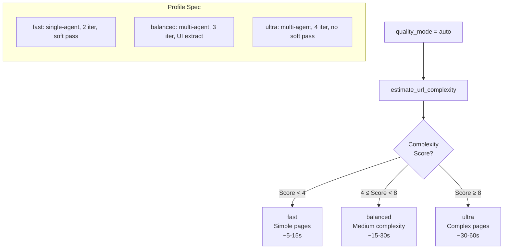
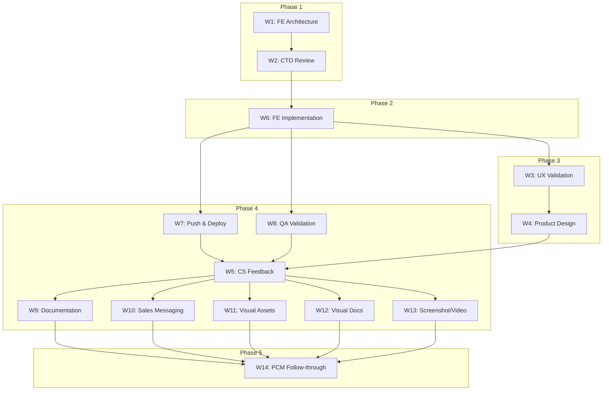
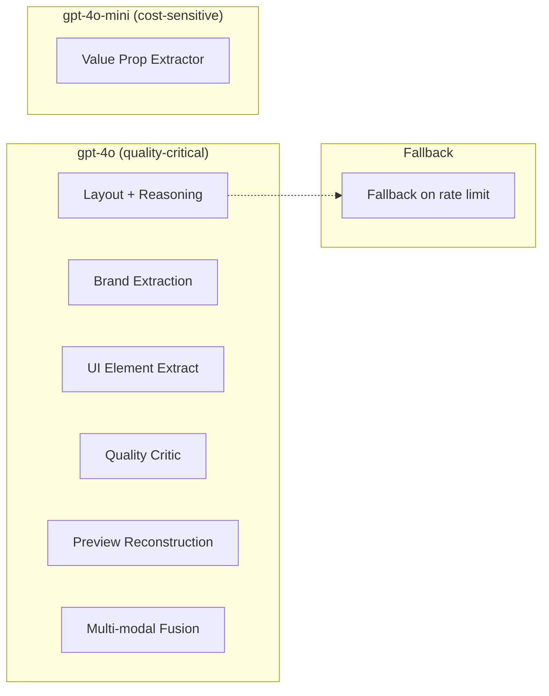

# MyMetaView 3.5 — Visual Documentation

**Issue:** AIL-108  
**Parent:** AIL-96 (MyMetaView 3.5 grand plan)  
**Author:** Visual Documentation Specialist  
**Date:** 2026-03-10  
**References:** `agents/founding-engineer/TECHNICAL_ARCHITECTURE_MYMETAVIEW_3.5.md`, `agents/coo/EXECUTION_PLAN_MYMETAVIEW_3.5.md`

---

## 1. System Architecture — 10x Generation Pipeline

High-level component view of the MyMetaView 3.5 preview generation system.

```mermaid
flowchart TB
    subgraph Input
        URL[URL Input]
        QM[Quality Mode<br/>fast / balanced / ultra / auto]
    end

    subgraph Cache["Cache Layer (Redis)"]
        CK[Cache Key<br/>demo:preview:v4:{mode}:{url_hash}]
        HIT[Cache Hit?]
    end

    subgraph Pipeline["Generation Pipeline"]
        REASON[preview_reasoning.py<br/>Layout + Reasoning Stages 1-6]
        BRAND[brand_extractor.py<br/>Brand Colors]
        UI[ui_element_extractor.py]
        CRITIC[quality_critic.py]
        RECON[preview_reconstruction.py]
    end

    subgraph Models["LLM Models"]
        GPT4O[gpt-4o<br/>Layout, Brand, Critic]
        GPT4OMINI[gpt-4o-mini<br/>Value Prop, Fallbacks]
    end

    subgraph Output
        RESP[DemoPreviewResponse<br/>LayoutBlueprint + Meta Image]
    end

    URL --> CK
    QM --> CK
    CK --> HIT
    HIT -->|Miss| REASON
    HIT -->|Hit| RESP
    REASON --> BRAND
    BRAND --> UI
    UI --> CRITIC
    CRITIC --> RECON
    RECON --> RESP
    REASON -.-> GPT4O
    BRAND -.-> GPT4O
    CRITIC -.-> GPT4O
    REASON -.-> GPT4OMINI
```

---

## 2. Preview Generation Flow — End-to-End

Request-to-response flow with quality profile and cache integration.

```mermaid
flowchart LR
    subgraph Request
        R1[DemoPreviewRequest]
        R2[URL + quality_mode]
    end

    subgraph Resolve
        AUTO[resolve_quality_mode<br/>auto → fast/balanced/ultra]
        NORM[normalize_url_for_cache]
        HASH[MD5 hash]
    end

    subgraph CacheCheck
        KEY[Cache Key<br/>demo:preview:v4:{mode}:{hash}]
        REDIS[(Redis)]
    end

    subgraph Stages["Reasoning Stages"]
        S1[Stage 1-3<br/>Layout, Design DNA]
        S2[Stage 4-6<br/>Blueprint, Composition]
        S3[Brand + UI Extract]
        S4[Quality Critic<br/>Iterate if needed]
    end

    subgraph Response
        OUT[DemoPreviewResponse]
    end

    R1 --> R2
    R2 --> AUTO
    R2 --> NORM
    NORM --> HASH
    AUTO --> KEY
    HASH --> KEY
    KEY --> REDIS
    REDIS -->|Hit| OUT
    REDIS -->|Miss| S1
    S1 --> S2
    S2 --> S3
    S3 --> S4
    S4 --> OUT
```

---

## 3. Quality Profile Decision Flow

How `auto` mode resolves to `fast`, `balanced`, or `ultra` based on URL complexity.



---

## 4. Quality Profile Comparison

| Profile | Multi-Agent | UI Extraction | Threshold | Iterations | Soft Pass | Use Case |
|---------|:-----------:|:-------------:|:---------:|:----------:|:---------:|----------|
| **fast** | No | No | 0.78 | 2 | Yes | Home, about; low complexity |
| **balanced** | Yes | Yes | 0.82 | 3 | Yes | Pricing, features; medium |
| **ultra** | Yes | Yes | 0.88 | 4 | No | Product, docs; high complexity |

---

## 5. Grand Plan Dependency Graph (AIL-96)

Workstream dependencies from the MyMetaView 3.5 execution plan.



---

## 6. Model Usage Map

Which models power which components (from technical architecture).



---

## 7. Prompt Library Structure (Target)

Proposed structure for centralized prompts (from technical architecture).

```
backend/prompts/
├── layout_reasoning/
│   ├── system_layout_stage1.txt
│   ├── system_layout_stage4.txt
│   └── few_shot_examples.json
├── brand_extraction/
│   └── system_brand.txt
├── quality_critic/
│   └── system_critic.txt
└── schemas/
    ├── layout_blueprint.json
    └── reasoning_output.json
```

---

## References

- [Technical Architecture (AIL-97)](/root/paperclip-agents/agents/founding-engineer/TECHNICAL_ARCHITECTURE_MYMETAVIEW_3.5.md)
- [Execution Plan (AIL-96)](/root/paperclip-agents/agents/coo/EXECUTION_PLAN_MYMETAVIEW_3.5.md)
- [CTO Architecture Review (AIL-98)](/root/paperclip-agents/.agent-workspaces/cto/AIL98_CTO_ARCHITECTURE_REVIEW.md)
