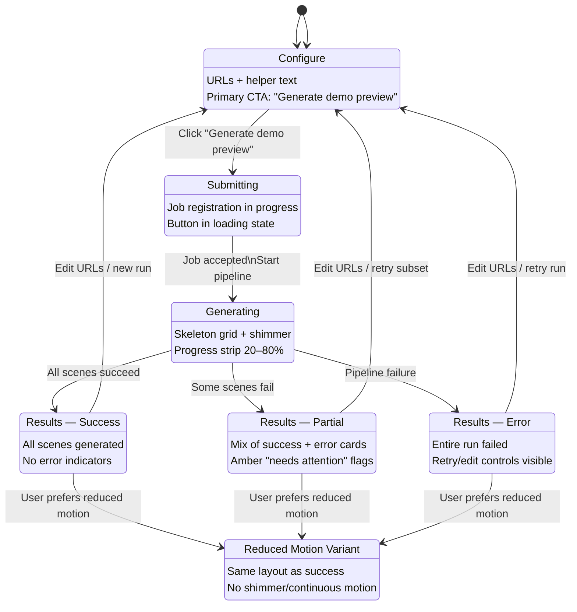
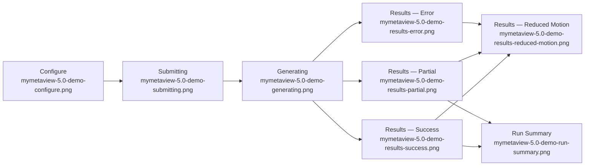

# MyMetaView 5.0 — Visual Documentation (Demo Generation)

**Issue:** AIL-154  
**Parent:** AIL-145 (MyMetaView 5.0 demo generation workstream)  
**Program:** AIL-142 (MyMetaView 5.0 execution delegation)  
**Author:** Visual Documentation Specialist  
**Date:** 2026-03-11  
**References:**  
- `agents/graphics-specialist/MYMETAVIEW_5.0_DEMO_SCREENSHOT_SPEC.md`  
- `agents/graphics-specialist/MYMETAVIEW_5.0_VISUAL_ASSETS_SUMMARY.md`  
- `agents/visual-documentation-specialist/MYMETAVIEW_3.5_VISUAL_DOCUMENTATION.md`  

---

## 1. Scope and Objectives

This document provides **visual documentation for the MyMetaView 5.0 demo-generation experience**, focused on:

- The **demo-generation state machine** (configure → submitting → generating → results).
- The **end-to-end demo-generation flow** from URL input to demo-ready scenes.
- How **screenshots and animations** specified in the 5.0 graphics workstream map onto this flow.
- How **3.5/4.0 architecture concepts** carry forward into the 5.0 demo story.

It is intended for:

- Product and design teams shaping the 5.0 **demo narrative and deck**.
- Engineering and animation teams implementing **demo flows** consistent with the underlying architecture.
- Sales and marketing using **visuals and diagrams** in presentations or documentation.

---

## 2. Demo-Generation State Machine (5.0)

High-level UI state machine for the MyMetaView 5.0 demo-generation experience, aligned with the screenshot spec.



**Notes**

- This state machine is the canonical reference for demo-generation screenshots defined in `MYMETAVIEW_5.0_DEMO_SCREENSHOT_SPEC.md`.
- The **reduced-motion variant** is represented as a separate state for clarity, but is implemented by applying `prefers-reduced-motion` to the same base UI.

---

## 3. Demo-Generation Flow — End-to-End (5.0)

End-to-end flow from demo request to rendered demo scenes, connecting UI states to the underlying generation pipeline.

```mermaid
flowchart LR
    subgraph User["User / Demo Visitor"]
        U1[Enter URLs\n(multiple lines)]
        U2[Click \"Generate demo preview\"]
    end

    subgraph DemoUI["Demo Generation UI (5.0)"]
        C[Configure State\nURLs + helper text]
        S[Submitting State\nJob registration]
        G[Generating State\nSkeleton grid + progress strip]
        RS[Results — Success]
        RP[Results — Partial]
        RE[Results — Error]
    end

    subgraph Backend["Generation Backend (3.5/4.0 pipeline reused)"]
        RQ[DemoPreviewRequest\n(urls, quality_mode)]
        QM[Resolve quality_mode\n(auto → fast/balanced/ultra)]
        CK[Compute cache key\n demo:preview:v4:{mode}:{url_hash}]
        REDIS[(Redis Cache)]

        subgraph Stages["Reasoning & Generation Stages"]
            ST1[Layout + Reasoning\n(Stages 1–3)]
            ST2[Blueprint + Composition\n(Stages 4–6)]
            ST3[Brand + UI Extract]
            ST4[Quality Critic\nIterate if needed]
        end

        RESP[DemoPreviewResponse\nScenes + metadata]
    end

    subgraph Outputs["Demo Outputs"]
        D1[Demo Scenes Grid\n(thumbnails/cards)]
        D2[Run Summary Sidebar]
        D3[Error + Retry Controls]
    end

    U1 --> C
    C --> U2
    U2 --> S

    S --> RQ
    RQ --> QM
    RQ --> CK
    CK --> REDIS

    REDIS -->|Hit| RESP
    REDIS -->|Miss| ST1
    ST1 --> ST2 --> ST3 --> ST4 --> RESP

    RESP --> G
    G --> RS
    G --> RP
    G --> RE

    RS --> D1
    RS --> D2

    RP --> D1
    RP --> D2

    RE --> D3
```

**Key alignments with 3.5 documentation**

- The **Backend** block reuses the 3.5 **10x generation pipeline** (reasoning stages, brand extraction, critic) and **quality profile decision flow**.
- 5.0 adds a **demo-focused front-end shell** (`DemoUI`) that presents these results as a multi-state storyboard suitable for live demos and screenshots.

---

## 4. Quality Profiles in the 5.0 Demo Story

5.0 inherits the **quality profiles** from 3.5 (`fast`, `balanced`, `ultra`) but simplifies how they are surfaced in the demo:

- **fast** — ideal for simple marketing sites; shows as a **quick run** in the demo.
- **balanced** — default for most demo URLs; shown as a **good trade-off** between speed and fidelity.
- **ultra** — used selectively for complex or flagship URLs; in demos, this is framed as **“production-grade preview fidelity.”**

```mermaid
flowchart TD
    START[Demo quality_mode]
    MODE{Selected mode?}

    AUTO[auto]
    FAST[fast]
    BAL[balanced]
    ULTRA[ultra]

    EST[estimate_url_complexity]
    SCORE{Complexity score?}

    START --> MODE
    MODE --> AUTO
    MODE --> FAST
    MODE --> BAL
    MODE --> ULTRA

    AUTO --> EST
    EST --> SCORE

    SCORE -->|Score < 4| FAST
    SCORE -->|4 ≤ Score < 8| BAL
    SCORE -->|Score ≥ 8| ULTRA

    FAST --> OUT_FAST[Demo run\n\"fast\" badge]
    BAL --> OUT_BAL[Demo run\n\"balanced\" badge]
    ULTRA --> OUT_ULTRA[Demo run\n\"ultra\" badge]
```

**Demo-facing guidance**

- When building demo slides or narrating the flow, emphasize that 5.0 **inherits the proven 3.5/4.0 profiles** rather than introducing a new, unproven mode set.
- Where UI supports it, subtle badges or labels can be used on the results grid or run summary to indicate the **effective profile** used for the run.

---

## 5. Screenshot Storyboard — Mapping States to Assets

This storyboard links the **state machine** to concrete **screenshot assets** defined in `MYMETAVIEW_5.0_DEMO_SCREENSHOT_SPEC.md`.



**Usage in decks and docs**

- For the **5.0 demo presentation**, this storyboard can be laid out as a **linear strip** (Configure → Generating → Results) with annotations pulled from this document.
- The **reduced-motion variant** is used in **accessibility slides** to show that the same information is available without continuous motion.
- The **run summary** screenshot is used in slides explaining **how operators triage demo runs** (success, needs attention, error).

---

## 6. Architecture Evolution — 3.5 to 5.0 (Conceptual)

Conceptual diagram showing how 5.0 builds on the 3.5/4.0 architecture, adding a demo-specific experience layer.

```mermaid
flowchart TB
    subgraph V35["MyMetaView 3.5 / 4.0"]
        A1[Core Preview API\n(10x pipeline + cache)]
        A2[Quality Profiles\nfast / balanced / ultra]
        A3[Prompt Library\nlayout, brand, critic]
    end

    subgraph V50["MyMetaView 5.0"]
        B1[Demo Generation UI\n(stateful experience)]
        B2[Demo Storyboard\nscreenshots + animation]
        B3[Run Summary UX\nsuccess / partial / error]
    end

    V35 --> V50

    A1 --> B1
    A2 --> B1
    A2 --> B3
    A3 --> B2
```

**Key message**

- 5.0 is **not a separate engine**; it is a **demo-grade shell** on top of the existing 3.5/4.0 preview system, with:
  - Better **state handling** for demo runs.
  - A **visual storyboard** that makes underlying quality controls legible.
  - Assets that can be reused across **docs, marketing, and sales**.

---

## 7. Handoff Notes by Role

**Screenshot and Video Specialist**

- Use the storyboard in §5 as a reference when:
  - Capturing live demo sequences for video.
  - Choosing which frames to freeze for slides and documentation.
- Ensure that transitions between **Configure → Generating → Results** are clear and visually consistent.

**Product Designer / Demo Owner**

- For issue AIL-157 (demo deck), use:
  - This document for **flow and architecture diagrams**.
  - `MYMETAVIEW_5.0_DEMO_SCREENSHOT_SPEC.md` for **canonical frames**.
  - `MYMETAVIEW_5.0_VISUAL_ASSETS_SUMMARY.md` for **asset inventory and brand alignment**.

**Visual Documentation Specialist (future updates)**

- If the demo-generation UI changes (new states, different layouts), update:
  - The **state machine diagram** in §2.
  - The **end-to-end flow** in §3.
  - The **storyboard mapping** in §5, including asset names.
- Keep this document and the graphics specs **synchronized** so diagrams always match the canonical demo experience.

